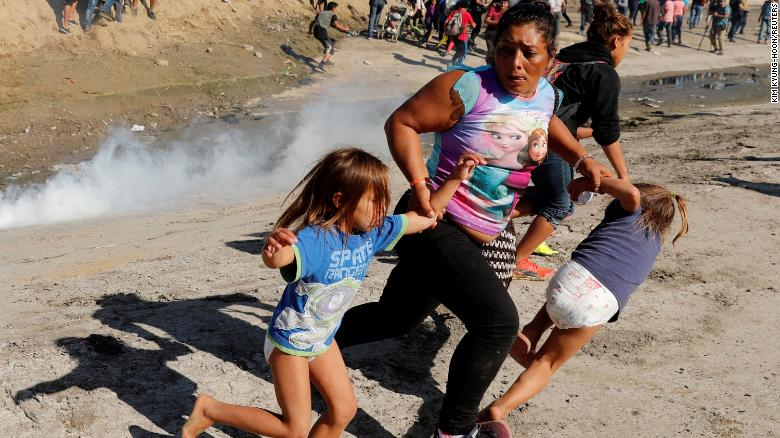

# US border guards firing tear gas at migrants

On Sunday, the US-Mexican border was _closed_
for several hours
as
migrants attempted to find their
way across the border into the US

  The migrants have become a political tools in Tijuana too:

> The people of Tijuana will not pay for the stay of these
> migrants. I will not send Tijuana into debt, just like I have been
> able to avoid the last two years,

said Tijuana mayor Juan Manuel Gastélum Buenrostro.
  
* [CNN](https://www.cnn.com/) coverage
